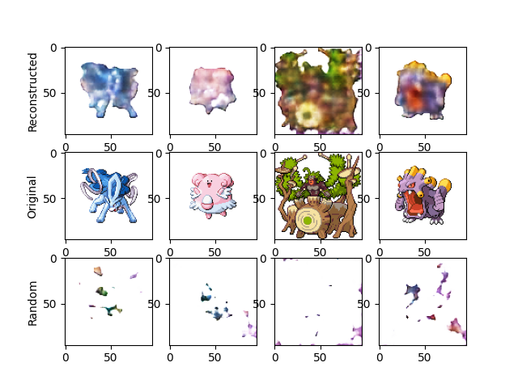
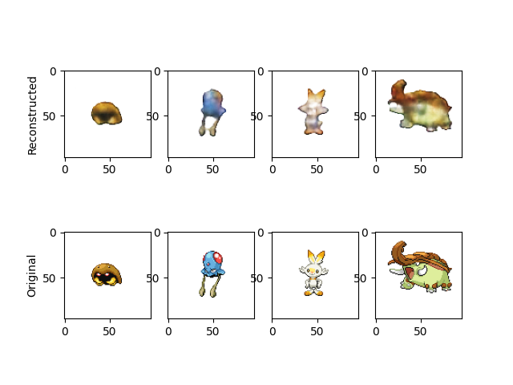

# Pokemon Sprite VAE

A variational autoencoder trained on Pokémon sprite images, built as a follow-up
to a CIFAR-10 CNN classifier project. Where the CNN project focused on
classification, this project focuses on generative modeling: learning a latent
space that can reconstruct sprites and generate novel ones.

## Motivation

A plain autoencoder learns to map each input to a single point in latent space,
which makes it good at reconstruction but unsuitable for generating anything new
— there's no principled way to pick a "new" point that decodes to something
meaningful. A VAE instead trains the encoder to output a *distribution*
(a mean and variance) for each input, and a KL-divergence term pulls those
distributions toward a standard normal, N(0,1). This creates a tension: pure
reconstruction loss wants each image mapped to a precise, unique point, while
the KL term pushes all of those points toward a shared, overlapping region.
That tension is what makes the latent space structured enough to sample from
after training — pick a random point in N(0,1) space, decode it, and (ideally)
get something new. Pokémon sprites were chosen as the dataset because they're
small, fixed-size (96×96), visually distinctive, and immediately recognizable,
making it easy to visually judge whether the model is actually working.

## Status

✅ Core pipeline complete: data processing, VAE architecture, training with
KL annealing, masked reconstruction loss, evaluation, and generation. See
[Results](#results) for an honest account of what worked and what didn't.

## Dataset

[Pokémon sprite images](https://www.kaggle.com/datasets/yehongjiang/pokemon-sprites-images)
(Kaggle, uploaded by yehongjiang).

Of the full dataset, this project uses **8,143 front-facing sprites**, all
96×96 RGB, verified free of corruption. Sprites are organized by species with
front/back and normal/shiny variants; only front-facing, non-shiny sprites
were used. 48 Pokédex entries (event variants, Totem forms, some
Mega/Gigantamax forms) had no matching sprite and were excluded.

Images are normalized to pixel values in [-1, 1] to match the decoder's tanh
output activation, and split 80/10/10 into train/validation/test sets.

**Not included in this repo.** Download from the link above and place the
extracted images in `data/`.

### Attribution & usage note
Pokémon designs, names, and sprite artwork are the property of Nintendo,
Creatures Inc., and Game Freak. This dataset and project are used strictly
for non-commercial, educational purposes as part of a machine learning
portfolio. No ownership is claimed over the original character designs or
any images generated by the model trained here. 

Code in this repository is licensed under MIT (see `LICENSE`); this does
not extend to the dataset or any generated outputs — see the note above.

## Architecture

**Encoder:** 4 convolutional layers (kernel=3, stride=2, padding=1), reducing
spatial resolution 96→48→24→12→6 while expanding channels 3→16→32→64→128,
with ReLU activations between layers. The flattened output feeds two separate
linear heads producing μ and log(σ²), each a 128-dimensional vector.

**Reparameterization:** z = μ + σ·ε, where ε ~ N(0,1), σ = exp(0.5·logσ²).
This makes sampling differentiable, so gradients can flow back through the
encoder during training.

**Decoder:** Mirrors the encoder via transpose convolutions, expanding
96→12→24→48→96 spatial resolution (6→12→24→48→96) and reducing channels
128→64→32→16→3, with ReLU between layers and a final tanh activation.

## Training

**Loss function:** reconstruction loss + β · KL divergence.

- *Reconstruction loss* is a **masked, weighted squared error**: background
  (pure white) pixels get a weight of 1, foreground pixels get a weight of 5.
  This was added after observing that, under plain pixel-wise MSE, background
  pixels — which dominate each image by pixel count — drowned out the
  gradient signal for small, detail-rich regions like eyes and facial
  features. The weighting measurably improved facial detail in reconstructions
  at a fraction of the training time plain MSE required.
- *KL divergence* uses the standard closed-form expression for a diagonal
  Gaussian against N(0,1), summed over latent dimensions and over the batch.
- *β annealing*: β ramps linearly from 0 to a capped value over the first 50%
  of training, then holds at that cap. This prevents posterior collapse early
  in training, when the decoder hasn't yet learned anything useful to decode
  and the "free" way to minimize KL loss is to ignore the input entirely.

**Optimizer:** Adam, default settings, batch size 64.

**Epoch count:** 250. An earlier 1000-epoch run showed validation loss
bottoming out around epoch 175–200 and climbing steadily afterward while
training loss kept dropping — a clear overfitting signal — so later runs were
capped well short of that point. Model checkpoints are only saved when
validation loss reaches a new best value, so the saved weights always
correspond to the best-performing epoch, not simply the last one.

## Results

### Reconstruction & generation

The model reconstructs real sprites well: silhouettes, overall body shape, and
color are consistently recovered, including fine-grained negative space (gaps
between limbs, ear notches) with sufficient training time. Fine facial
features (eyes, mouths) remain the weakest point — these occupy very few
pixels per image, so even with loss weighting, the gradient signal for them is
small relative to the rest of the image.

Sampling random latent vectors from N(0,1) and decoding them directly (no
input image, no encoder involved) produces incoherent, blob-like output —
color patches with little to no recognizable Pokémon structure, shown in the
bottom row below.


*Top: reconstructions of real test-set images. Middle: the original images.
Bottom: sprites generated from random N(0,1) latent vectors, no input image
involved.*

A clear, visible overfitting signal shows up when comparing train-set
reconstructions to test-set reconstructions from the same checkpoint: train
reconstructions are noticeably sharper and more accurate, directly confirming
the train/validation loss divergence seen in training.


*Top: reconstructions of real train-set images. Bottom: the originals. Compare
sharpness and color accuracy to the test-set reconstructions above.*

### Generation

Sampling random latent vectors from N(0,1) and decoding them directly (no
input image, no encoder involved) produces incoherent, blob-like output —
color patches with little to no recognizable Pokémon structure.


This was isolated and debugged through a series of controlled experiments:

- **Ruling out architecture capacity:** training with β=0 (no KL pressure at
  all) produced sharp, highly recognizable reconstructions, confirming the
  encoder/decoder have more than enough capacity to represent fine Pokémon
  detail. The failure is not a model-capacity problem.
- **Ruling out β as the fix:** comparing β capped at 1.0 vs. 0.5 showed more
  color diversity in random samples at the lower cap, but no improvement in
  shape coherence — meaning β controls how strongly individual encodings get
  pulled toward N(0,1), not how *densely* the latent space ends up covered.
- **Conclusion:** with only ~8,000 training images spread across hundreds of
  visually distinct species, the *aggregate* posterior (all encoded images
  taken together) is too sparse to densely cover the N(0,1) region. A randomly
  sampled point is likely to land in a region of latent space the decoder
  never received a meaningful training signal for. This is a dataset-scale and
  architecture-capacity limitation, not a bug — and the standard fixes
  (more data, a larger/deeper architecture, a perceptual or adversarial loss
  term) are meaningfully larger undertakings than this project's scope.

## Limitations & future work

- Periodic spikes appear in both train and validation loss throughout
  training, most likely caused by Adam's fixed learning rate occasionally
  overshooting near a minimum. A learning rate scheduler or gradient clipping
  would likely resolve this.
- Random generation quality is capped by dataset size/diversity relative to
  latent space coverage, as detailed above. More training data, a deeper
  architecture, or a perceptual/adversarial loss term are the standard next
  steps.
- No early stopping is implemented; the best checkpoint is retained via
  validation-loss tracking instead.

## How to run

```bash
python src/main.py
```

You'll be prompted to run training or load the existing checkpoint
(`y`/`n`). If running testing/generation only, make sure `file_name_pth` in
`train.py` points to the checkpoint you want to load.

## Project structure

```
src/
├── explore_data.py      # Dataset enumeration and verification
├── data_processing.py   # Dataset/DataLoader, train/val/test split
├── vae.py                # Encoder, decoder, VAE model definition
├── train.py              # Training loop, losses (masked MSE + KL)
├── evaluate.py            # Evaluation loop (no gradient updates)
├── run_training.py       # Orchestrates a full training run
├── run_testing.py        # Test-set evaluation and generation functions
└── main.py               # Entry point: train (optional) + test + visualize
```